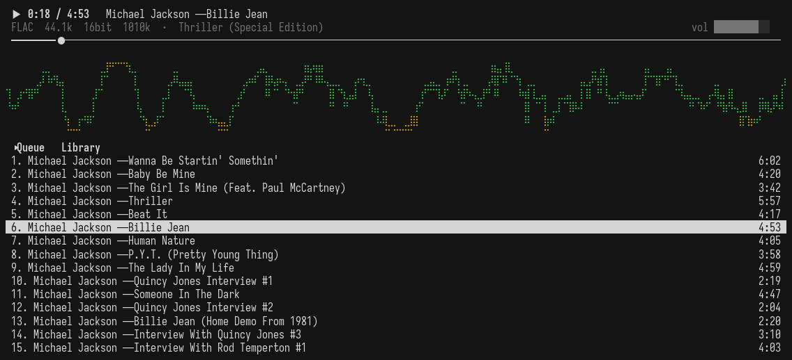
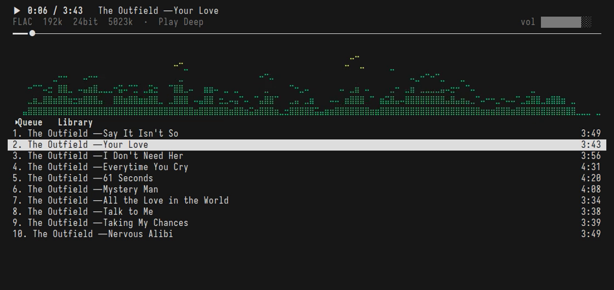
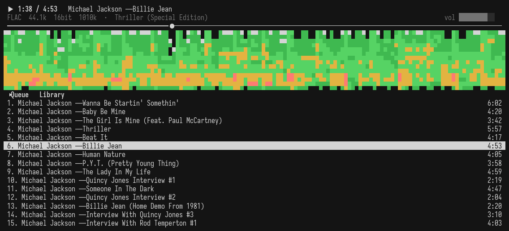
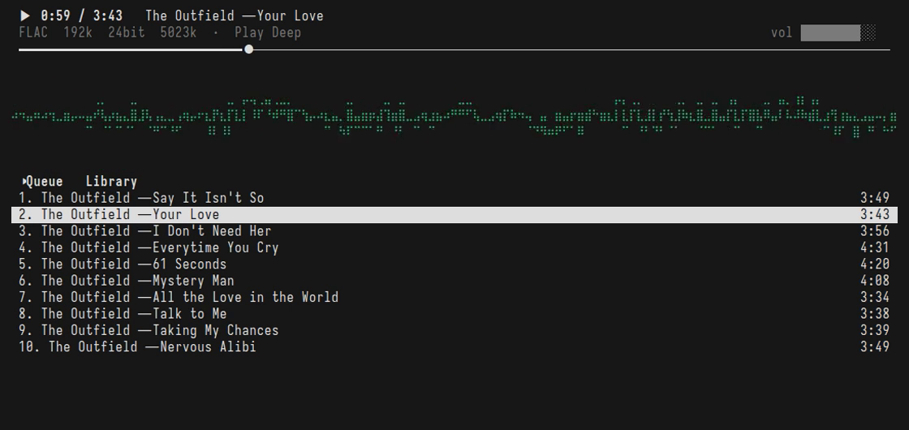
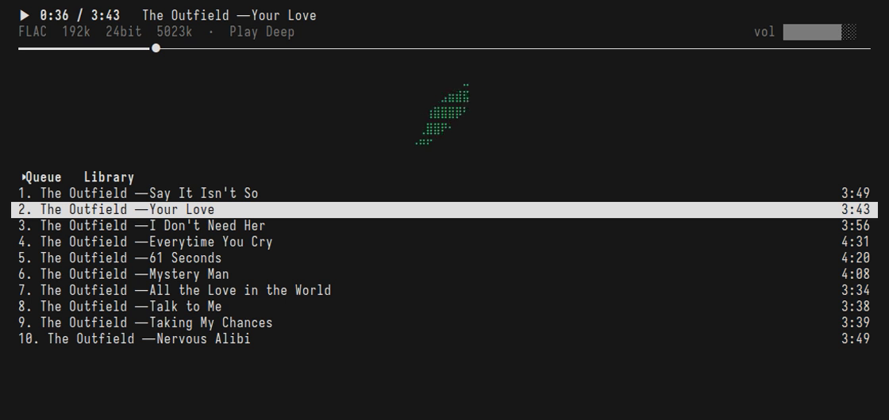
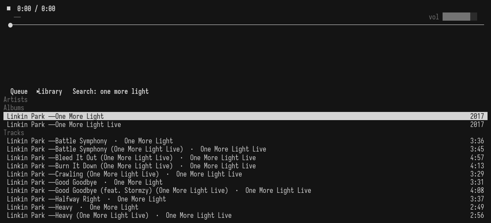

# dotamp

A terminal music player drawn in dots. Plays your Plex or Navidrome library, Winamp-shaped, with four visualizers drawn in braille, in any modern terminal.

| Spectrum bars | Spectrogram |
|---|---|
|  |  |
| **Oscilloscope** | **Stereo field** |
|  |  |

Search asks every server at once and groups what it finds:

## Install

Homebrew builds it locally, so there is no unsigned-binary warning:

    brew install brady1408/tap/dotamp

With Go:

    go install github.com/brady1408/dotamp/cmd/dotamp@latest

Or take a prebuilt binary from the [releases](https://github.com/brady1408/dotamp/releases). Those are unsigned for now: macOS wants a right-click → Open on first launch, Windows SmartScreen wants "More info → Run anyway".

## First run

    dotamp

The first run asks one question: Plex, Navidrome, or both. Plex sign-in is a link to approve in your browser; from then on dotamp finds your servers through your account, the LAN address at home, the public address when you're away, Plex's relay as a last resort. Navidrome is a URL, a username and a password, asked once. Then the player opens.

Later, the same steps are available as commands: `dotamp login`, `dotamp navidrome URL USER`, and `dotamp servers` to list every server and how each one is reached.

With both kinds of library configured, search covers all of them, the Servers entry in the Library menu switches the one you browse, and the queue can mix them.

## Use

Run `dotamp`. The deck on top shows the track, its album and format, the clock and the seek bar. The visualizer takes the middle. The bottom pane is Queue or Library.

| Key | Action |
|---|---|
| space | play / pause |
| `n` / `p` | next / previous track |
| ← / → | seek 5 s |
| `+` / `-` | volume |
| Tab | switch Queue / Library |
| `/` | search every server at once |
| Enter | open an artist, album or playlist; on a track, play its album or playlist from there |
| `a` | add the album, playlist or track to the queue |
| `w` | save the queue as a playlist |
| `x` / `c` | remove the selected track from the queue / clear the queue |
| Backspace | back |
| `A`–`Z`, `#` | jump to a letter in the artist index |
| `s` / `r` | shuffle / repeat |
| `v` | spectrum bars / oscilloscope / spectrogram / stereo field |
| `?` | help |
| `q` | quit |

The mouse works too: click the seek bar, double-click a row, scroll the lists.

The Library opens on a menu: **Artists** is every artist on the current server with letter jumps, **Recently added** the latest albums, **Playlists** every playlist on every server, each saved queue included, and **Servers** appears when more than one server with music is reachable, your Navidrome, your Plex, and any Plex shared with you. Search always asks all of them and groups the results by server, marking copies that live on a remote or relayed server. Every album row carries a quality tag on the right, `FLAC 16/44.1` or `MP3 320k`, read from its first track a moment after the list appears, so two copies of an album read apart before you play either. `w` saves the queue as a playlist on the server its tracks live on; a queue that mixes servers makes one playlist per server with the same name, and the notice says what went where.

Tracks play as the original file, FLAC included, with gapless transitions between tracks. A file that would not fit through Plex's relay is transcoded to MP3 320 on the way.

Output is 32-bit float at one fixed device rate, 44.1 kHz unless `output_rate` says otherwise. Every file is converted to that rate once, through a windowed-sinc resampler that passes a tone within a fraction of a decibel and rejects aliasing by better than 40 dB. If your DAC runs at 48 or 96 kHz, set `output_rate` to match and nothing is converted twice.

## Visualizers

`v` cycles four views of what the speaker is playing right now, all drawn from the same audio tap thirty times a second, all taking their colours from your terminal's palette:

- **Bars**: a spectrum analyzer, one braille column per terminal column on a log frequency axis, with peak caps that hold and fall.
- **Oscilloscope**: the waveform as a line, triggered on a zero crossing so a steady tone holds still.
- **Spectrogram**: a waterfall scrolling left to right, frequency bottom to top, loudness as colour. Harmonics stack as lines, drums are vertical streaks, reverb fades to the right.
- **Stereo field**: left channel across, right channel up. Mono draws a diagonal, a wide mix fills a cloud, a channel out of phase leans the other way.

The one you leave it on is remembered.

## Config

`~/.config/dotamp/config.json` is written by the first run. Optional keys:

| Key | Meaning |
|---|---|
| `server_name` | which of the account's servers to browse by default; the first owned one otherwise |
| `remote_bitrate` | kbps to transcode to on any non-local connection, e.g. `192` to save mobile data; original when unset |
| `server`, `token` | a fixed server and token, which skip account discovery entirely |
| `navidrome` | `{"url", "user", "password"}` for a Subsonic server; written by the first run or `dotamp navidrome` |
| `visual` | the visualizer to start on: `bars`, `scope`, `spectrogram` or `stereo`; `v` updates it |
| `output_rate` | the sample rate the audio device is opened at; 44100 when unset. Set it to your DAC's rate (48000, 96000, …) so the OS does not resample a second time |

The log lives at `~/Library/Caches/dotamp/dotamp.log` on macOS and `~/.cache/dotamp/dotamp.log` elsewhere. `dotamp --debug` adds every HTTP request to it.

`dotamp --silent` runs without a sound device: nothing is heard, but the visualizers move exactly as they would over speakers. It is how the pictures above are made, and it lets dotamp run on a box with no audio.

## Terminals

Any terminal with truecolor, mouse reporting and a font that has braille: iTerm2, Ghostty, Kitty, WezTerm, Windows Terminal with Cascadia Mono. The analyzer's colours come from your terminal's palette.

The font decides how the visualizers look. Braille glyphs in some fonts carry padding above and below their dots, which turns a bar into a stack of bricks with a seam between every row of cells. Fonts whose dots reach the cell edges tile into solid shapes: **Iosevka** and **Cascadia Mono** do; Menlo has no braille at all and macOS substitutes a font that doesn't tile. In iTerm2, "Use a different font for non-ASCII text" lets you keep your text font and give only the dots to Iosevka; a vertical spacing around 85 closes any remaining seam. On Windows, WezTerm or Windows Terminal with Cascadia Mono needs no tuning.

On macOS 15 and later the terminal app needs Local Network access the first time (System Settings → Privacy & Security → Local Network). If you see `connect: no route to host` while `curl` to the same address works, grant it and relaunch the terminal; the permission is read at launch.

## Build

    make build      # this machine
    make mac        # darwin/arm64
    make windows    # windows/amd64
    make test
    make demo       # re-record the pictures in docs/ (needs tmux, asciinema, agg, ffmpeg, Iosevka)

Pure Go, no cgo, on every platform.

## License

MIT
